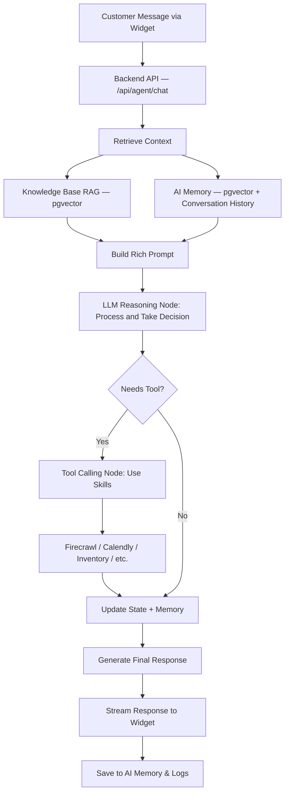

# PNPBrain — Architecture

## High-Level Overview

PNPBrain is a monorepo (Turborepo) composed of four deployable apps and a set of shared packages. The backend owns all agent logic; frontends are thin clients.

```
apps/
  backend/      # Agent execution, REST + streaming API
  admin/        # Owner-facing dashboard (KB, skills, analytics)
  widget/       # Embeddable chat widget (script tag / React)
  marketing/    # Public-facing pnpbrain.com site

packages/
  agent/        # LangGraph graph, nodes, checkpointing
  db/           # Drizzle schemas (Supabase / Postgres + pgvector)
  tools/        # Firecrawl + future integrations
  types/        # Shared TypeScript types
```

---

## Customer Entry Points

| Entry Point | Description |
|-------------|-------------|
| WordPress Plugin | Installs the widget on WP/WooCommerce sites |
| Script Tag | `<script>` embed for any site |
| Custom Frontend | Direct integration via the widget package |
| Template-generated Widget | Config-driven embed for agency/template use |

---

## Agent Execution Flow



---

## Component Responsibilities

### `apps/backend`
- Single source of truth for agent execution.
- Exposes clean REST + streaming endpoints.
- Hosts the full LangGraph `StateGraph`.
- Handles: authentication, rate limiting, logging, tool execution.

### `apps/admin`
- Standalone dashboard with its own Tailwind/component setup.
- Features: KB upload, Firecrawl refresh, skills config (allowed domains, API keys), conversation viewer, basic analytics.
- Future: lead scoring dashboard, A/B response testing.

### `apps/widget`
- Lightweight React component + minified script tag.
- Calls the backend API only — **no direct LLM access**.
- Chat UI with typing indicators and streaming responses, fully brandable.

### `apps/marketing`
- Public face of pnpbrain.com.
- Sections: Hero, Problem/Solution, How It Works, Pricing, Docs, Demo/Signup CTA.

### `packages/agent`
- LangGraph graph definition.
- Nodes: `retrieve`, `reason`, `tool_call`, `respond`.
- Conversation checkpointing logic (stored in Supabase).

### `packages/db`
- Drizzle ORM schemas: `knowledge_base`, `conversations`, `ai_memory`, `skills_config`.
- Targets Supabase Postgres + pgvector.

### `packages/tools`
- Firecrawl tool (AI-native scraping returning clean Markdown/JSON).
- Input/output schemas for every tool.
- Stubs for Calendly, Zoom, Razorpay, e-comm/CRM integrations.

### `packages/types`
- Shared TypeScript interfaces used across the monorepo.

---

## Data Layer

| System | Purpose |
|--------|---------|
| Supabase Postgres | Primary relational store (conversations, config, leads) |
| pgvector | Vector embeddings for KB retrieval and AI memory |

---

## AI Layer

| Environment | Model |
|-------------|-------|
| Local dev | Ollama (model documented in root README) |
| Production | Switchable via `LLM_PROVIDER` env var |

---

## Key Design Principles

- **Separation of concerns** — Backend owns agent logic; frontends are thin clients.
- **Local-first dev** — Ollama + Supabase local; cloud switch via env vars.
- **Guardrails** — All responses grounded in retrieved knowledge; tools restricted to owner-approved domains; no raw LLM calls from the frontend.
- **Scalability** — Stateless API routes + persistent LangGraph checkpoints in Supabase; supports extracting a heavy scraping worker without breaking the monorepo.

---

## Technology Decisions

| Decision | Rationale |
|----------|-----------|
| **Turborepo + Next.js** | Fast builds, single repo, easy local dev, Vercel scaling |
| **Dedicated backend app** | Clear separation; easier to containerize, scale, or swap later |
| **Ollama for dev** | Zero cost, full privacy, fast iteration |
| **Supabase + pgvector** | Built-in auth, vector search, realtime, excellent Next.js DX |
| **Firecrawl** | AI-native scraping returning RAG-ready output; restricted to owner domains |
| **LangGraph** | Checkpointing makes conversations resumable and observable; nodes are independently testable |
