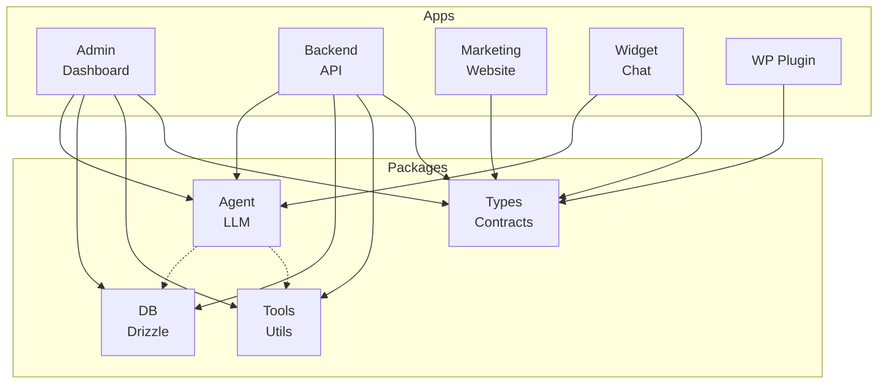
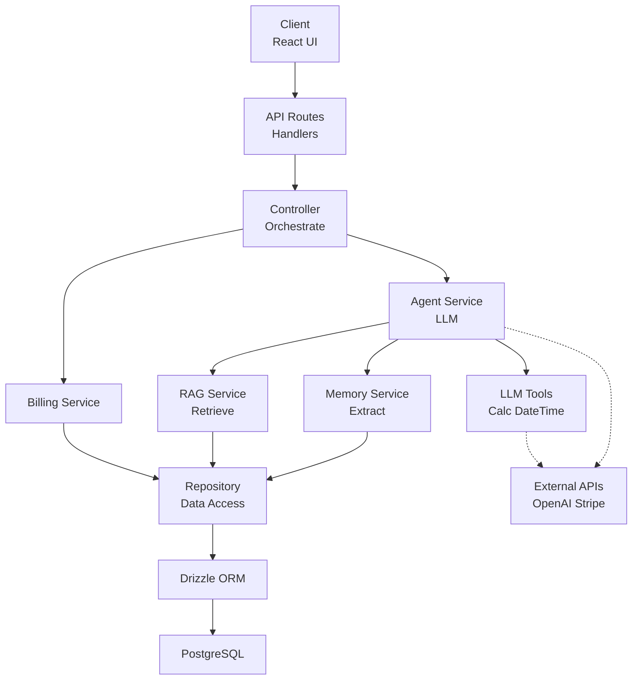
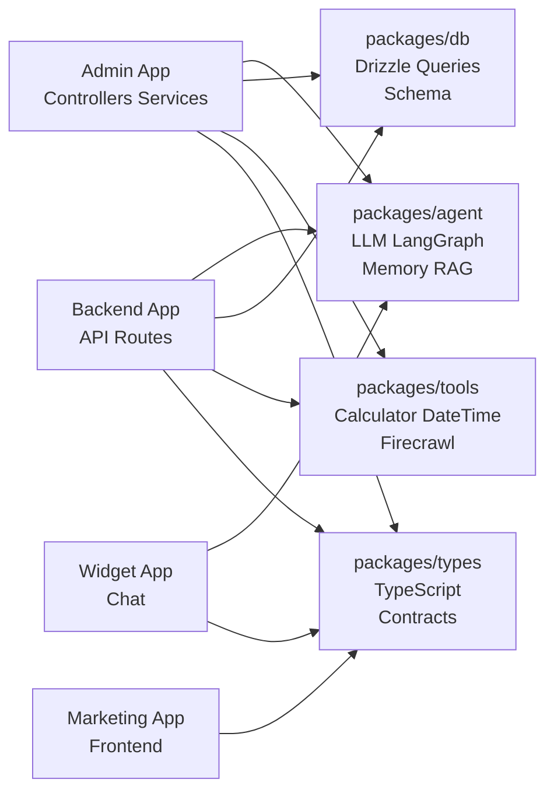
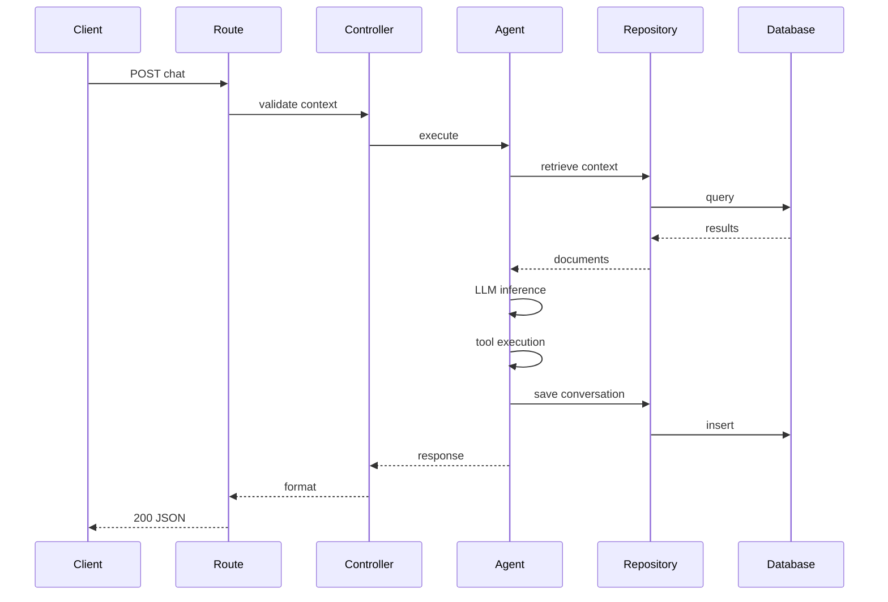

# GCFIS Architecture Diagrams

Visual representations of the GCFIS monorepo structure and data flow.

## 1. Monorepo Architecture Overview

## 2. Layered Service Architecture

## 3. Package Structure and Ownership

## 4. Agent Execution Flow

## 5. Technology Stack Matrix

| Layer | Technology | Purpose |
|-------|-----------|---------|
| **Frontend** | React + Next.js App Router | UI components, server-side rendering |
| **Type Safety** | TypeScript (strict mode) | Compile-time type checking |
| **Package Management** | pnpm + Turborepo | Monorepo orchestration & caching |
| **Backend** | Next.js API Routes | HTTP endpoints, middleware |
| **Database** | PostgreSQL + Drizzle ORM | Structured data, migrations |
| **Agent** | LangGraph + LangChain | Workflow orchestration, tool calling |
| **LLM** | OpenAI, Anthropic | Language model inference |
| **Tools** | Calculator, DateTime, Firecrawl | Agent tool ecosystem |
| **Styling** | Tailwind CSS + PostCSS | Utility-first CSS |
| **Integration** | Stripe, Supabase | Payment & auth services |

## Key Architecture Principles

- **Modularity**: Each package has one responsibility
- **Type Safety**: Strict TypeScript across all layers
- **Dependency Injection**: Services receive dependencies via constructor
- **Separation of Concerns**: Routes handle transport, controllers orchestrate, services contain logic
- **Database Abstraction**: Drizzle ORM for type-safe queries
- **Clean Exports**: Apps import only from package `exports` map, no deep imports
- **Composability**: Build complex flows from small, testable units
